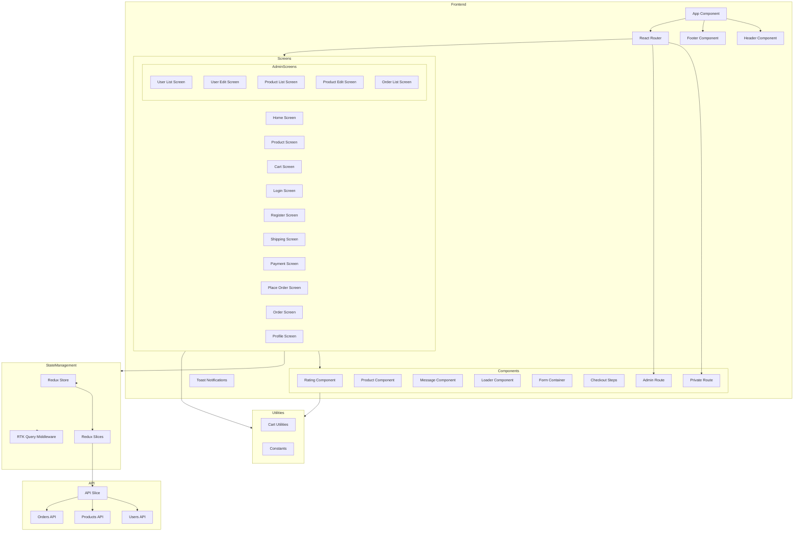

    

    <b>Automatic Architecture Diagrams from Code</b> 
    <a href="https://github.com/swark-io/swark">GitHub</a> • <a href="https://swark.io">Website</a> • <a href="mailto:contact@swark.io">Contact Us</a>

## Usage Instructions

1. **Render the Diagram**: Use the links below to open it in Mermaid Live Editor, or install the [Mermaid Support](https://marketplace.visualstudio.com/items?itemName=bierner.markdown-mermaid) extension.
2. **Recommended Model**: If available for you, use `claude-3.5-sonnet` [language model](vscode://settings/swark.languageModel). It can process more files and generates better diagrams.
3. **Iterate for Best Results**: Language models are non-deterministic. Generate the diagram multiple times and choose the best result.

## Generated Content
**Model**: GPT-4o - [Change Model](vscode://settings/swark.languageModel)  
**Mermaid Live Editor**: [View](https://mermaid.live/view#pako:eNp1Vc1u2zAMfhXB5_YFchgQtCs2rNm6uD05OWgW4wizJUOStxVF330SRSmK7R4akfw-UxT_-la1WkC1qQ6qM3w8s-f7g2LMTr-i-mC0cqBEMDK2HcfG_7E7PYxagXLHaP8CXIBp4rFAH7R2Ho3HAt3rKaB74K0jhZBnza1r8Jd9106eZMud1MoSnoOsWwOgbLT6aPQA0dQEkeBjgp-MFlPriEHanHTHTWIEcQ4_6k4qwlGeE_bQSeufQpykzmn1WY6jVB3RkroImb8OPmMp5KgtSD1v4YcR-VI0MLTMuSVtleDTcpI9XJIUtDkpF2ArhpSOXAXGXiyYR_9schJUFvS5m8j8LOQVM-hLJpWrcJsKuO6Z0MJ54q_7x2QU3mNy1nznochCTkdu8ZyMvW9c1TXxWIxADjMHt2TswFreQUPnCuNR4xDGYwV_0Ga489PMpcJpNAPL6qXvz9D-9kNYOxhtkzSGahGt_MMd4LA2pMTRzRTsiEhA8QqmjOFxtW1q5z3tuPIPDB1OCwLE9K_BX0_QJnmpe9mCTQAqhOykED385Qaa_fM39nMC81oYj-uXb5--pi0n0V3jLdEx-Q19aT2KDWrDBwRQ2RBLcgFjEyEYpQwtg3hxspdOAnVO2D3BZOMWyig59vWzjvs-a7J07Tcs69vbT7SgS0vcxqUl7t5giRIai6EurGUDzKBL4QNAnyNyPRUlslL2mSkGGCqN12HJ8UssO36AUgyB6hcfF2UEUv0WQFG_BZaL91FYl8YKjMsr45VlPcs3F0B1Uw1gBi6F_z_8dqjc2Ts_VBt2qASc-NS7Q_XuSdMo_O33kvtWGaqNMxPcVHxyun5VbdKNnrpztTnx3sL7fzObrSg) | [Edit](https://mermaid.live/edit#pako:eNp1Vc1u2zAMfhXB5_YFchgQtCs2rNm6uD05OWgW4wizJUOStxVF330SRSmK7R4akfw-UxT_-la1WkC1qQ6qM3w8s-f7g2LMTr-i-mC0cqBEMDK2HcfG_7E7PYxagXLHaP8CXIBp4rFAH7R2Ho3HAt3rKaB74K0jhZBnza1r8Jd9106eZMud1MoSnoOsWwOgbLT6aPQA0dQEkeBjgp-MFlPriEHanHTHTWIEcQ4_6k4qwlGeE_bQSeufQpykzmn1WY6jVB3RkroImb8OPmMp5KgtSD1v4YcR-VI0MLTMuSVtleDTcpI9XJIUtDkpF2ArhpSOXAXGXiyYR_9schJUFvS5m8j8LOQVM-hLJpWrcJsKuO6Z0MJ54q_7x2QU3mNy1nznochCTkdu8ZyMvW9c1TXxWIxADjMHt2TswFreQUPnCuNR4xDGYwV_0Ga489PMpcJpNAPL6qXvz9D-9kNYOxhtkzSGahGt_MMd4LA2pMTRzRTsiEhA8QqmjOFxtW1q5z3tuPIPDB1OCwLE9K_BX0_QJnmpe9mCTQAqhOykED385Qaa_fM39nMC81oYj-uXb5--pi0n0V3jLdEx-Q19aT2KDWrDBwRQ2RBLcgFjEyEYpQwtg3hxspdOAnVO2D3BZOMWyig59vWzjvs-a7J07Tcs69vbT7SgS0vcxqUl7t5giRIai6EurGUDzKBL4QNAnyNyPRUlslL2mSkGGCqN12HJ8UssO36AUgyB6hcfF2UEUv0WQFG_BZaL91FYl8YKjMsr45VlPcs3F0B1Uw1gBi6F_z_8dqjc2Ts_VBt2qASc-NS7Q_XuSdMo_O33kvtWGaqNMxPcVHxyun5VbdKNnrpztTnx3sL7fzObrSg)

